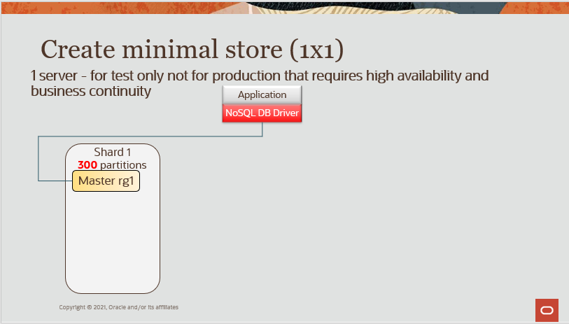
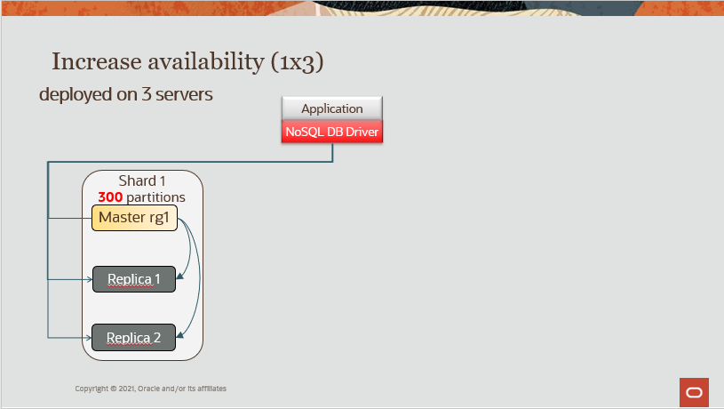
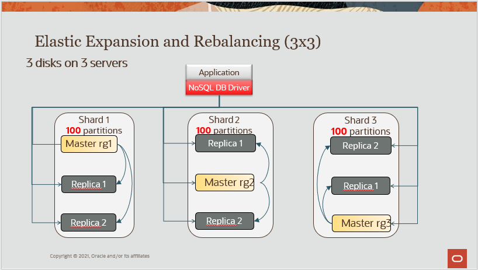

# demo-simple-nosql-cluster

## Prerequisites 

Just before start an Oracle NoSQL installation, I recommend to read those links
- https://docs.oracle.com/en/database/other-databases/nosql-database/21.1/release-notes/overview.html
- https://docs.oracle.com/en/database/other-databases/nosql-database/21.1/admin/installation-prerequisites.html

```
sudo yum install git
git clone https://github.com/dario-vega/demo-simple-nosql-cluster.git
```

### Open JDK

The client and server have been tested and certified against OpenJDK 11.0.2 (Oracle NoSQL 21.1 version). We encourage you to upgrade to the latest Java release to take advantage of the latest bug fixes and performance improvements. We expect to certify Oracle NoSQL Database with more recent Java versions in a future release.


I've tested with multiple Open JDK versions and it is working with all versions as documented.
```
sudo yum -y install java-8-openjdk-devel
sudo yum -y install java-11-openjdk-devel
sudo yum -y install java-13-openjdk-devel
sudo yum -y install java-latest-openjdk-devel
#donwload openjdk-11.0.2_linux-x64_bin.tar.gz
```
If it is not the case run the following command and send me the output
````
java -XshowSettings:properties 2>&1 | grep vendor
````

### Oracle JDK

The Oracle NoSQL Database server is compatible with Java SE 8 (64-bit), and the client is compatible with Java SE 8. Both the client and the server require at least Java SE 8, and should work with more recent Java SE versions

I've tested with multiple Oracle JDK versions and it is working with all versions as documented.

```
sudo yum install java
sudo yum install -y jdk1.8
# download the rmp 
sudo yum localinstall jdk-13.0.2_linux-x64_bin.rpm
```
```
sudo alternatives --config java
```

FYI, In this demo, I will install our cluster using a jdk1.8 version in order to have access jps - Java Virtual Machine Process Status Tool

## Download and unzip the binary and exemples

Donwload the [Oracle NoSQL Database Servers](https://www.oracle.com/database/technologies/nosql-database-server-downloads.html)
- Community Edition : Oracle NoSQL Database Community Edition (CE) software is licensed pursuant to the Apache 2.0 License (Apache 2.0). 
- Enterprise Edition
- Oracle NoSQL Database Migrator

In this demo, we will use the Oracle NoSQL Database Servers - Enterprise Edition [Release 21.1](https://docs.oracle.com/en/database/other-databases/nosql-database/21.1/release-notes/index.html)

For more information about difference between versions and other topics, visit the [FAQ](https://www.oracle.com/database/technologies/nosqldb-learnmore-nosqldb-faq.html)

```
unzip kv-ee-21.1.12.zip -d nosql
unzip kv-examples-21.1.12.zip -d nosql
unzip nosql-migrator-1.0.0.zip
````

## Config & start agent 

Before you configure Oracle NoSQL Database, you should determine the parameters for each Storage Node in the store. 
Each of these parameters are directives to use with the makebootconfig utility, [see the documentation](https://docs.oracle.com/en/database/other-databases/nosql-database/21.1/admin/installation-configuration-parameters.html#GUID-9E2B0453-A0CF-4F34-8A82-A6D801D6C929)

1) Configue using the makebootconfig utility
2) Start the Oracle NoSQL Database Storage Node Agent (SNA)

In our case, we will use the following scripts [clean.sh](./script/clean.sh) and [boot.sh](./script/boot.sh) 

**TIP**: run jps to validate that nothing is running from a previous test. if it is the case, just kill the processes. (**NB** If you are not using Oracle JDK, use ps command)
````
[opc@node1-nosql ~]$ jps
9060 ManagedService
9017 kvstore.jar
14633 Jps
````
Run the commands clean.sh and boot.sh

### Useful script

Source the following env variables and alias
```
cat env.sh

export KVROOT=/home/opc/nosql/kvroot
export KVDATA=/home/opc/nosql/data
export KVHOME=/home/opc/nosql/kv-21.1.12
export KVHOST=`hostname`

echo $KVROOT
echo $KVDATA
echo $KVHOME
echo $KVHOST
```

### Configuring the Firewall

Do not forget to configure all firewalls. To make sure your firewall works with Oracle NoSQL Database, you should set the ports specified by the servicerange parameter 
of the makebootconfig command. This parameter is used to constrain a store to a limited set of ports, usually for security or data center policy reasons. 
By default the services use anonymous ports. 

For demo purpose, I will stop the firewall in all my servers.

````
# Use the appropiate command, in my case I am using 5.4.17-2102.200.13.el7uek.x86_64 
sudo systemctl stop firewalld
````

## Deploy your cluster

We will deploy our cluster in multiple steps in order to illustrate most popular scenarios :
1) Create minimal store (1x1) - 1 server - for test only not for production that requires high availability and business continuity
2) Increase availability (1x3) - deployed on 3 servers but only 1 shard - increase the replication factor from 1 to 3 for high availability and business continuity
3) Elastic Expansion and Rebalancing (3x3) - 3 disks on 3 servers - increase the capacity and rebalance the cluster using the new 3 shards


In our case, we will use the following scripts for each scenario
1) [config1x1.kvs](./script/config1x1.kvs)
2) [config1x3.kvs](./script/config1x3.kvs) 
3) [config3x3.kvs](./script/config3x3.kvs) 

```
java -jar $KVHOME/lib/kvstore.jar runadmin -port 5000 -host node1-nosql load -file config1x1.kvs
```

```
java -jar $KVHOME/lib/kvstore.jar runadmin -port 5000 -host node1-nosql load -file config1x3.kvs
```

```
java -jar $KVHOME/lib/kvstore.jar runadmin -port 5000 -host node1-nosql load -file config3x3.kvs
```


## Validate your deployment

```
java -jar $KVHOME/lib/kvstore.jar ping  -port 5000 -host node1-nosql
```

## Fill the store with different tables
```
cd $KVHOME
javac -cp examples:lib/kvclient.jar examples/hadoop/table/LoadVehicleTable.java
java -classpath lib/kvclient.jar:examples   hadoop.table.LoadVehicleTable  -store OUG -host node1-nosql -port 5000 -nops 1000
```

## Running the http proxy and test using the github project demo graphql

```
cd $KVHOME
nohup kv_proxy &

```

https://github.com/dario-vega/demo-graphql-nosql

## Monitoring

Being a distributed system, the Oracle NoSQL Database is composed of several software components and each expose unique metrics that can be monitored, interpreted, and
utilized to understand the general health, performance, and operational capability of the Oracle NoSQL Database cluster
 
There are three basic mechanisms for monitoring the health of the Oracle NoSQL Database: 
*	System Log File Monitoring
*	System Monitoring Agents - Integration with JMX based monitoring solutions. It is also possible to do an integration with central Information Event Management system or Application Performance Management tools (eg system based on ELK).
*	**Application Monitoring**
Good proxy for the “health” of the Oracle NoSQL Database rests with application level metrics. 
Metrics like average and 90th percentile response times, average and 90th percentile throughput, as well average number of timeout exceptions encountered from NoSQL API
calls are all potential indicators that something may be wrong with a component in the NoSQL cluster. 

1. System Log File Monitoring

The Oracle NoSQL Database is composed of the multiples components, and each component produces log files that can be monitored

```
$ cd $KVROOT/$KVSTORE/log
$ ls -1  | grep -v lck
admin1_0.log
admin1.je.config.csv
admin1.je.info.0
admin1.je.stat.csv
config.rg1-rn1
config.rg2-rn1
config.rg3-rn1
OUG_0.log
OUG_0.perf
OUG_0.stat
OUG_1.stat
OUG_2.stat
rg1-rn1_0.log
rg1-rn1.gc.0.current
rg1-rn1.je.config.csv
rg1-rn1.je.info.0
rg1-rn1.je.stat.csv
rg2-rn1_0.log
rg2-rn1.gc.0.current
rg2-rn1.je.config.csv
rg2-rn1.je.info.0
rg2-rn1.je.stat.csv
rg3-rn1_0.log
rg3-rn1.gc.0.current
rg3-rn1.je.config.csv
rg3-rn1.je.info.0
rg3-rn1.je.stat.csv
sn1_0.log
```
the defaut directory is  $KVROOT/$KVSTORE/log but look the configuration in case of customization
```
kv-> show parameter -service sn1

RN Log directories:
    path=/nosql/oracle/product/rnlog1
    path=/nosql/oracle/product/rnlog2
    path=/nosql/oracle/product/rnlog3
Admin directory:
    path=/nosql/oracle/product/admin size=2024-MB 
```
2. System Monitoring Agents

Oracle NoSQL Database is also monitored through JMX based system management tools. For JMX based tools, the Oracle NoSQL MIB is found in lib directory of the installation 
along with the JAR files for the product. For more information on JMX, see the documentation. 

Show the JMX configuration for a specific Storage Node (NB. Remember, this is a distributed system, you need validate each storage Node)

```
kv-> show parameter -service sn1
mgmtClass=oracle.kv.impl.mgmt.NoOpAgent
```
To enable JMX:

```
plan change-parameters -service sn1 -wait -params "mgmtClass=oracle.kv.impl.mgmt.jmx.JmxAgent"
plan change-parameters -service sn2 -wait -params "mgmtClass=oracle.kv.impl.mgmt.jmx.JmxAgent"
plan change-parameters -service sn3 -wait -params "mgmtClass=oracle.kv.impl.mgmt.jmx.JmxAgent"
```
To disable JMX:
```
plan change-parameters -service sn1 -wait -params "mgmtClass=oracle.kv.impl.mgmt.NoOpAgent"
plan change-parameters -service sn2 -wait -params "mgmtClass=oracle.kv.impl.mgmt.NoOpAgent"
plan change-parameters -service sn3 -wait -params "mgmtClass=oracle.kv.impl.mgmt.NoOpAgent"
```
You can validate using jconsole. (NB. Remember, this is a distributed system, you need validate each storage Node)
```
jconsole localhost:5000
```

**Enabling the Collector Service**

Elasticsearch is a search and analytics engine. Logstash is a server-side data processing pipeline that ingests data from multiple sources simultaneously, transforms it,
and then send it to a “stash” like Elasticsearch. Kibana lets users visualize data with charts and graphs in Elasticsearch. The ELK stack can be used to monitor Oracle 
NoSQL Database.

Not all central Information Event Management system or Application Performance Management tools are reading JMX. In this case, we can Enable the Collector Service, in order
to create JSON files with all the metrics available.

```
kv-> show parameter  -global
collectorEnabled=false
collectorInterval=20 SECONDS
collectorRecorder=null
collectorStoragePerComponent=30 MB
storeName=OUG
```
Enabling the Collector Service
```
kv-> plan change-parameter -global -wait -params collectorEnabled=true
```
Now, you can see the json files created at this location with all information polled to JMX 

```
$ cd $KVROOT/$KVSTORE/sn1/collector
$ ls -1
loggingStats_0.json
ping_0.json
plan_0.json
rnEndpointGroup_0.json
rnEnv_0.json
rnEvent_0.json
rnException_0.json
rnJVM_0.json
rnOp_0.json
rnTable_0.json
```

You can then Set Up a tool like Filebeat on Each Storage Node to send the JSON files to your favorite APM System (e.g ELK setup)

e.g. (https://docs.oracle.com/pls/topic/lookup?ctx=en/database/other-databases/nosql-database/21.1/admin&id=filebeat-yml)

For ELK, Oracle Nosql is providing all the configuration templates to setup the metrics and do analysis using Kibana.

https://docs.oracle.com/en/database/other-databases/nosql-database/21.1/admin/using-elk-monitor-oracle-nosql-database.html#GUID-A04811FD-E5FA-4149-AFBE-0E3389A1CC2D

If you use the template files provided above, then the following indexes are available:
    kvrnjvmstats-*
    kvrnenvstats-*
    kvpingstats-*
    kvrnopstats-*


## Other topics to explore - 🚧 🚧 🚧 

1) Secure your cluster
2) Backup & Recovery
3) Export Import
4) HDD Failure simulation
5) REST API to Administrate Oracle NoSQL Database
6) Upgrade
7) [Multi- Regions](./MRTABLE.md)

- https://docs.oracle.com/en/database/other-databases/nosql-database/21.1/admin/index.html
- https://docs.oracle.com/en/database/other-databases/nosql-database/21.1/security/index.html


# Running Oracle NoSQL Database On Public Cloud (OCI, Azure, AWS)

The following [Quick Start white paper](https://www.oracle.com/a/otn/docs/database/oracle-nosql-cluster-setup-oci.pdf) is designed as a reference guide for
deploying the Oracle NoSQL Database on the OCI platform. Read the APPENDIX A -RUNNING ORACLE NOSQLDATABASE ON OTHER CLOUDS

Scripts on https://www.oracle.com/database/technologies/nosql-database-server-downloads.html

This script lets a user set up a small cluster (1-10 machines) quickly, for use in proof-of-concepts, small on premise installations, and cluster installations 
in cloud environments (OCI, AWS, Azure). It's easy to BYOL to the cloud environment of your choosing.

# Oracle NoSQL Database Cloud Service
[Oracle NoSQL Database Cloud Service](https://www.oracle.com/database/nosql-cloud.html) is a fully managed database cloud service that is designed for database operations that require predictable, single digit millisecond latency responses to simple queries. NoSQL Database Cloud Service allows developers to focus on application development rather than setting up cluster servers, or performing system monitoring, tuning, diagnosing, and scaling. 

